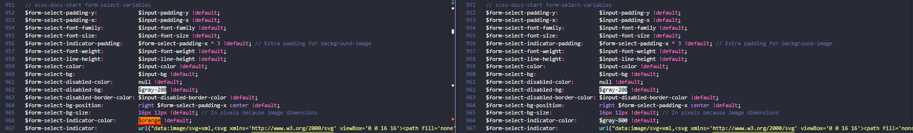
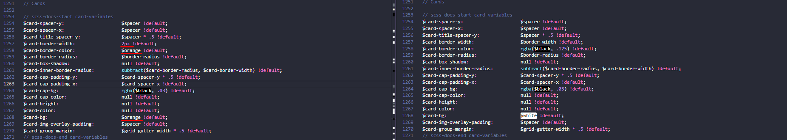

# Informe práctica Bootstrap y SASS.-

## Índice:

- [**Modificaciones**](#modificaciones)
    - [**Variables**](#variables)
    - [**Body**](#body)
    - [**Forms**](#forms)
    - [**Dropdowns**](#dropdowns)
    - [**Cards**](#cards)
    - [**Accordion**](#accordion)
    - [**Modals**](#modals)
    - [**Alerts**](#alerts)
    - [**Breadcrumbs**](#breadcrumbs)
    - [**Carrousel**](#carrousel)
    - [**Code**](#code)
- [**Resultado final**](#resultado-final)

## Modificaciones.-

### Variables:

Los cambios que se han hecho en cuanto a la página del exámen del primer trimestre han sido todos en el scss de variables (a la izquierda se encontraran los cambios realizados y a la derecha cómo estaraba el scss anteriormente). Lo primero que se ha cambiado ha sido la posición de la definición de las variables de cada color con sus respectivas variaciones de tonalidad, para poder usarlos luego al definir los colores principales que se van a usar:

### Body:

En cuanto al body, se hicieron cambios en los colores de fondo, de letra y en el alineado de los textos:

### Forms:

Luego, en la parte de formularios se modificaron las siguientes variables:

### Dropdowns:

Después, en los dropdowns se cambiaron solo lso colores de distintos elementos:

### Cards:

En las cartas se modificaron tanto el color del borde, como su grosor y el color de fondo:

### Accordion:

Lo siguiente que se cambió fue el color de letra, el color de fondo y el color del borde en los acordeones. A parte, se remplazó el icono que traía por otro "más adecuado":

### Modals:

En la parte de modales, simplemente se hizo un cambio en el color de fondo y en la opacidad del "difuminado" de detrás:

### Alerts:

Luego, en las alertas se modificaron las escalas de los colores de borde, fondo y letra:

### Breadcrumbs:

En los breadcrumbs, hubieron cambios en los colores del divisor, del link activo y del símbolo del divisor:

### Carrousel:

Aquí lo único que se modificó fueron los iconos de siguiente y anterior:

### Code:

Y por último, en las etiquetas `code` se cambió únicamente el color del texto:

### Resultado final.-

Y aquí les dejamos varias imagenes del resultado final, un tema anaranjado:

